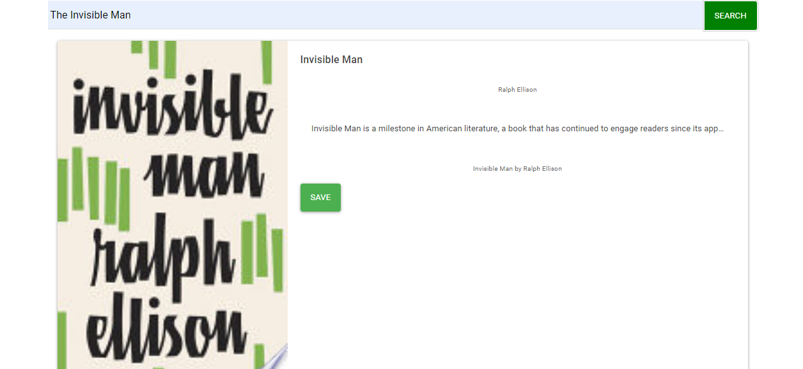
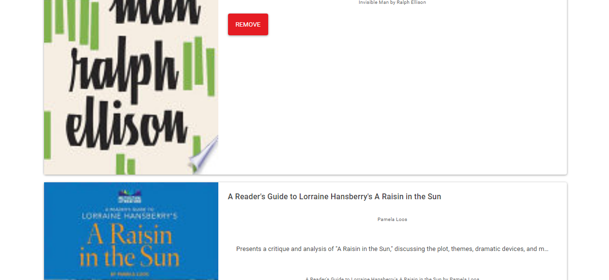

# React-Book-Search

* Deployment link: https://googling-books.herokuapp.com/

### Google API Book Search Using React.Js

* Search Page

* Search Results

* Saved Page

### Instructions

This application requires has 2 pages:

Search - User can search for books via the Google Books API and render them here. User has the option to "View" a book, bringing them to the book on Google Books, or "Save" a book, saving it to the Mongo database.

Saved - Renders all books saved to the Mongo database. User has an option to "View" the book, bringing them to the book on Google Books, or "Delete" a book, removing it from the Mongo database.

Added code to connect to a MongoDB database named googlebooks using the mongoose npm package.
Using mongoose, I then created a Book schema.
This application requires at minimum 2 pages, check out the following mockup images for each page:

Search - User can search for books via the Google Books API and render them here. User has the option to "View" a book, bringing them to the book on Google Books, or "Save" a book, saving it to the Mongo database.

Saved - Renders all books saved to the Mongo database. User has an option to "View" the book, bringing them to the book on Google Books, or "Delete" a book, removing it from the Mongo database.

Added code to connect to a MongoDB database named googlebooks using the mongoose npm package.
Using mongoose, then created a Book schema.
Books have the following fields:

title - Title of the book from the Google Books API
authors - The books's author(s) as returned from the Google Books API
description - The book's description as returned from the Google Books API
image - The Book's thumbnail image as returned from the Google Books API
link - The Book's information link as returned from the Google Books APIooks should have each of the following fields:

title - Title of the book from the Google Books API
authors - The books's author(s) as returned from the Google Books API
description - The book's description as returned from the Google Books API
image - The Book's thumbnail image as returned from the Google Books API
link - The Book's information link as returned from the Google Books API