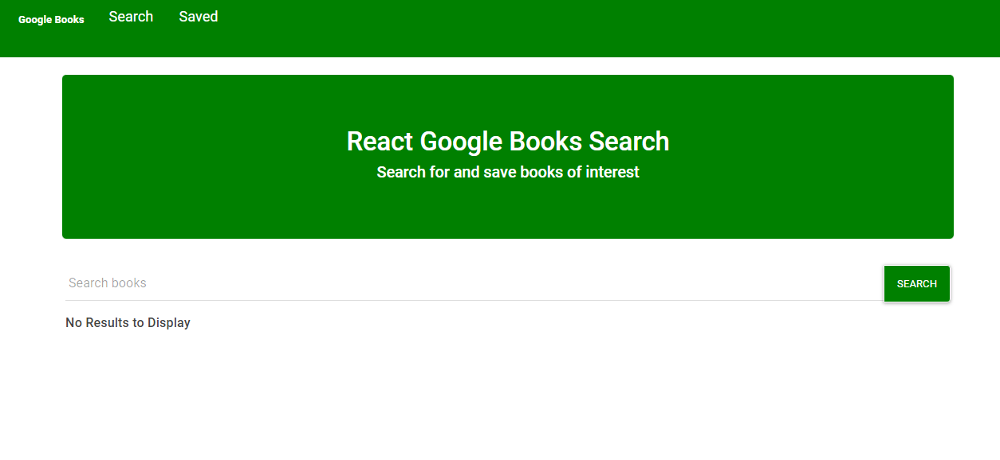

# React-Book-Search

* Deployment link: https://googling-books.herokuapp.com/

### Google API Book Search Using React.Js

* Search Page

* Search Results

* Saved Page

### Instructions

This application has 2 pages:

Search - User can search for books via the Google Books API and render them here. User has the option to "View" a book, bringing them to the book on Google Books, or "Save" a book, saving it to the Mongo database.

Saved - Renders all books saved to the Mongo database. User has an option to "View" the book, bringing them to the book on Google Books, or "Delete" a book, removing it from the Mongo database.

Added code to connect to a MongoDB database named googlebooks using the mongoose npm package.
Using mongoose, I then created a Book schema.
Books have each of the following fields:

* title - Title of the book from the Google Books API
* authors - The books's author(s) as returned from the Google Books API
* description - The book's description as returned from the Google Books API
* image - The Book's thumbnail image as returned from the Google Books API
* link - The Book's information link as returned from the Google Books API

I added the following Express routes for my app:

/api/books (get) - Returns all saved books as JSON.
/api/books (post) - Used to save a new book to the database.
/api/books/:id (delete) - Used to delete a book from the database by Mongo _id.
    * (get) - Loads my single HTML page in client/build/index.html. 